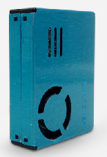

# PMS7003
Plantower PMS7003 dust monitor sensor library for TiJOS

| 条目       | 说明                              |
| ---------- | --------------------------------- |
| 驱动名称   | 攀藤通用颗粒物传感器模块驱动      |
| 适用       | 该驱动适用于PMS70XX系列灰尘传感器 |
| 通讯方式   | UART                              |
| Java Class | TiPMS7003.java                    |
| 图片       |      |

